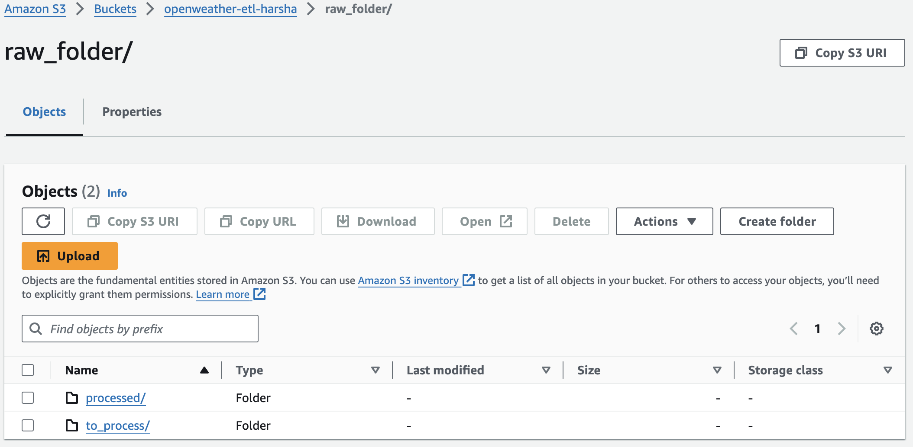

# OpenWeatherMap API Data End-To-End ETL using Python and AWS

This project deals with weather data from OpenWeatherMap API. Python and AWS services are utilized to accomplish End-To_End ETL process and finally make up the data as per requirements for analysis.

## Architecture

## Technologies Used:
- **Programming Language:** Python

### AWS Cloud Services:
1. AWS S3 Bucket - An Object Oriented Storage designed to store and retrieve any amount of data, such as files, images, videos, and backups, in the form of objects (which include the data itself, metadata, and a unique identifier).
2. AWS Lambda Function - A serverless computing service that automatically runs code in response to events, managing the underlying infrastructure, and scaling as needed without provisioning servers.
3. AWS CloudWatch - A comprehensive monitoring service that provides real-time visibility into the performance and health of your applications and AWS resources.
4. AWS Glue Crawler - An automated data discovery tool that scans your data sources, identifies data formats, and extracts metadata to create a schema.
5. AWS Glue Data Catalog - A fully managed, centralized repository that stores metadata and schema information about your data assets, enabling easy data discovery and management across various data sources.
6. AWS Athena - a serverless interactive query service that allows you to analyze data directly in Amazon S3 using standard SQL without the need for complex data processing or ETL workflows.

### Requirements:
The OpenWeather API provides the current weather report for specified cities. The goal is to design a data pipeline that pulls weather data for these cities whenever the job is triggered. The pipeline should ensure that city-related information and weather-related data are stored in separate database tables. Additionally, the database tables should always hold the most recent data for each job run, with no duplicate or outdated records from previous job executions.

-Initially, the code was developed in Jupyter Notebook `OpenWeather_ETL@jupy.ipynb`, and later implemented in AWS Lambda functions.

### Design:
- Create a S3 bucket `openweather-etl-harsha`.
- Create two folders in S3 bucket named `raw_folder/`, and `transformed/`.
  

- Create two folders in `raw_folder/` named `to_process/`, and `processed/`. Simillarly create two folders in `transformed/` named `weather_data/`, `city_data/`, and `athena_queries`(stores query results of AWS Athena).
  
  

- Create a **lambda function** `openweather-data-extract` to request and API call for weather report of specified cities from OpenWeather API and store the data of every city in json file. Store the json file in `to_process/`. Refer `OpenWeather_Extract@lambda.py` for code.
- Create another **lambda function** `openweather-json-transform-csv-load` to 
