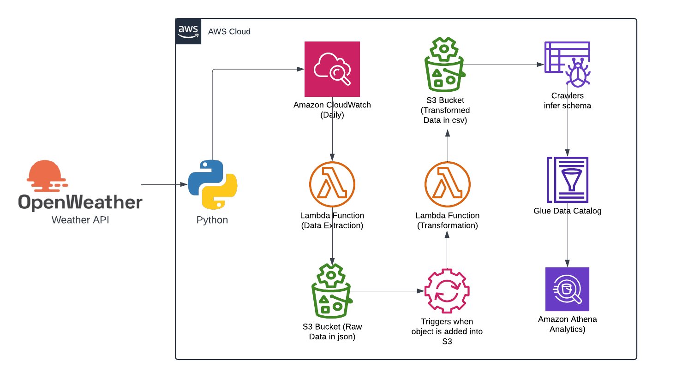

# OpenWeatherMap API Data End-To-End ETL using Python and AWS

This project demonstrates the extraction, transformation, and loading (ETL) of weather data from the OpenWeatherMap API using Python and various AWS services. The goal is to establish an automated pipeline that processes weather data for analysis, ensuring that only the most recent weather reports are stored and processed, eliminating duplicates and outdated records.

## Architecture



## Technologies Used:
- **Programming Language:** Python

### Python modules used

```python
import os
import json
import boto3
import requests
import pandas as pd
from io import StringIO
from datetime import datetime
```

### AWS Cloud Services:
1. **AWS S3 Bucket:** An object storage service that allows to store and retrieve any amount of data, including files, images, videos, and backups, using objects that consist of data, metadata, and unique identifiers.
2. **AWS Lambda Function:** A serverless computing service that automatically runs code in response to events, scaling as needed without requiring the provisioning of servers.
3. **AWS CloudWatch:** A monitoring and observability service that provides insights into the performance and health of AWS resources and applications in real-time.
4. **AWS Glue Crawler:** An automated data discovery service that scans data sources, detects formats, and extracts metadata to build a schema for data stored in S3 or other databases.
5. **AWS Glue Data Catalog:** A centralized repository that stores metadata and schema information about data assets, allowing for easy discovery and management.
6. **AWS Athena:** A serverless, interactive query service that enables you to analyze data stored in Amazon S3 using standard SQL, without the need for complex ETL processes.

### Requirements:
The OpenWeather API provides real-time weather reports for specified cities. This pipeline pulls weather data for cities at regular intervals. City-specific information is stored in one table, while weather-related data is stored in another. Each job execution ensures that only the most recent data is maintained in the tables, with no duplicates or old records from previous runs.

- Initially, the ETL process was developed in Jupyter Notebook (`OpenWeather_ETL@jupy.ipynb`), and later implemented in AWS Lambda functions.

### Design Overview:
- **S3 Bucket Setup:** Create an S3 bucket named `openweather-etl-harsha` with two primary folders:
  - `raw_folder/`: Stores raw data.
  - `transformed/`: Stores transformed data.
  
  *Folders in S3 Bucket*
  
  

- **Raw Folder Structure:** Inside `raw_folder/`, create:
  - `to_process/`: To hold incoming raw JSON files.
  - `processed/`: For storing processed files after successful transformations.
  
- **Transformed Folder Structure:** Inside `transformed/`, create:
  - `weather_data/`: For storing weather-related CSV data.
  - `city_data/`: For storing city-related CSV data.
  - `athena_queries/`: To store the query results from AWS Athena.
  
  *Sub-folders in raw_folder*
  
  

  *Sub-folders in transformed_folder*
  
  


- **Lambda Functions:**
  1. **openweather-data-extract**: A Lambda function that fetches the weather report for specified cities from the OpenWeather API and stores the data as JSON files in the `to_process/` folder of the S3 bucket. (Refer to `OpenWeather_Extract@lambda.py` for code.)
  
  2. **openweather-json-transform-csv-load**: This function reads the JSON files from `to_process/`, transforms the data into CSV format, and stores the city and weather data into their respective folders (`city_data/` and `weather_data/`). After processing, the JSON files are moved to `processed/`. (Refer to `OpenWeather_Transform@lambda.py` for code logic.)

- **Glue Crawlers:** 
  - Create two crawlers, `openweather_weather_crawler` and `openweather_city_crawler`, to crawl the `weather_data/` and `city_data/` CSV files and generate the corresponding metadata in the Glue Data Catalog.
  - Create different IAM roles for these crawlers and add a Glue database. If one doesn't exist, create a new database.
  - Enable the "Crawl new sub-folders only" option to avoid crawling older files.
  
  *Crawler to make new sub-folders crawl*
  
  
 

- **Schema Validation:** Once the crawlers have run, validate the schemas generated for the city and weather data tables in the Glue Data Catalog. Adjust the schemas if necessary.
  
  *Schemas of the database tables created by Glue Crawlers*
  
  


- **Managing Athena Queries:**
  - To avoid processing outdated data in Athena, delete the existing CSV files in the `weather_data/` and `city_data/` folders before each job run. Since Athena directly queries the data stored in S3, removing old files ensures only fresh data is processed.
  - After transforming the data and storing new CSV files, query the tables via Athena. Set up a folder (`athena_queries/`) in S3 to store the results of Athena queries.
  
  *Path to store query results of Athena*
  
  


- **Automation with CloudWatch:**
  - Use CloudWatch Events to automate the triggering of `openweather-data-extract` at a specified frequency.
  
  *CloudWatch Event trigger*
  
  


  - Set up an **S3 event trigger** for the `openweather-json-transform-csv-load` Lambda function to execute whenever a new file is uploaded to the `to_process/` folder. Ensure that the trigger is set for only the *put* operation to prevent the function from re-executing when the CSV files are written, which could lead to recursive job runs and errors.
  
  *S3 trigger*
  
  


- **Querying Data in Athena:** After the ETL process completes, validate the data by running queries in AWS Athena.

  *AWS Athena*
  
  


